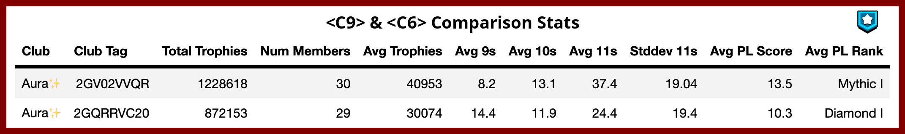
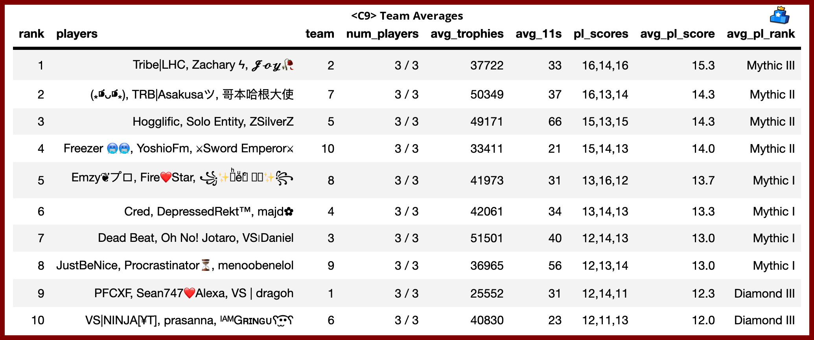

# 1. Installation 
#### 1.1 Software
- Download `Anaconda3` from https://www.anaconda.com/products/distribution. Install with all the default paths. <b>*Important*</b> make sure to select add conda to PATH
- Download `Chromedriver` from https://chromedriver.chromium.org/getting-started. Ensure it matches your Google Chrome version. Recommended to update google chrome to latest version as well.
- Create a `Github` account https://www.github.com/ 
- Install `git` for windows from https://git-scm.com/download/win 
- Install `wkhtmltopdf` from https://wkhtmltopdf.org/downloads.html. Add `/wkhtmltopdf/bin` to PATH in your environment variables (e.g `C:\Program Files\wkhtmltopdf\bin`)
#### 1.2. Virtual Environment
Create a virtual environment with Python==3.7. Install the Python library `brawlstats`. Run each line individually. You will only need to run this section once.
```
conda create -n brawlstars python==3.7
conda activate brawlstars
pip install brawlstats tqdm pandas tabulate pandasql xlsxwriter selenium IPython imgkit pillow undetected_chromedriver Jinja2 seaborn openpyxl dataframe-image lxml matplotlib
```

#### 1.3 Api Key
Insert your Brawl Stars Developer API Key after registering for an account at https://developer.brawlstars.com/ into `api_key.txt`. Place this file into a newly created file `Desktop/brawlstars/api_key.txt`. 

Enter the public IP address of your computer https://www.whatismyip.com/

#### 1.4 Downloading the Files
```
# Open a new command prompt
cd Desktop
git clone https://github.com/nicholas-wan/brawlstars.git
```

#### 1.5 Getting updates for the code
```
# Open a new command prompt
cd Desktop/brawlstars
git stash
git pull
```
<hr style="height:1px;border:none;color:#333;background-color:#333;" />

# 2. Basic Usage

#### 2.0. Activating Virtual Environment
You need this step before running code at all times.
```
# Open a new command prompt
cd Desktop/brawlers
conda activate brawlstars
```

#### 2.1. Club Level Statistics
Generates club level statistics. Default clubs are set to Aura C9 and C6
```
python main.py
```

#### 2.2. Aura - Custom Statistics 
Formats c6 and c9 team statistics by combining with team numbers from google sheets. Also creates team average level statistics. Run `main.py` before running this file. 

```
python aura.py
```

Outputs files to `/output/c9` or `/output/c6`

#### 2.2.1 Aura Sample Output



Comparison Statistics for different clubs. More clubs can be added. At a glance, shows the average <b>Trophy Level</b> for the members of the club and the average number of <b>Power Level 11 brawlers</b> for each member. Used at the start of <b>Club League</b> to get an indicative strength of opponents

 

Team Level Statistics for an individual club. Shows the average <b>Trophy Level</b> for the members of the club and the average number of <b>Power Level 11 brawlers</b> for each member in each team within the club. Useful for Club Leaders when allocating members to fixed teams.


Barchart of number of <b>Power Level 11 brawlers</b> for each member in the club. Sorted and coloured by team number. Useful to indicate to club leaders which members need more focusing on.

#### 2.3. Infographics

Obtains battle logs from top 200 players globally based on Solo PL rank.
```
python top_pl_players.py
python generate_infographics_pro.py 
```

Outputs infographics in `/output/infographics`

#### 2.2.1 Generate Infographics Sample Output


Shows the best brawlers for all <b> 18 Power / Club League </b> maps in two single images. Useful for anyone during drafting phase for Picks and Bans. Shown in order of USAGE RATES.


Aggregates the brawler win rates for all <b> 18 Power / Club League </b> and lists out the overall best brawlers to invest in. `freq` refers to how often the brawler is a top-12 win-rate brawler in a particular map, while `weighted_score` considers the position as well as the frequency.


<hr style="height:1px;border:none;color:#333;background-color:#333;" />

# 3. Custom Usage

#### 3.1. main.py 
Key in the tag as an argument with `-t`, seperated by space and the code will automatically detect if it is a club or player. 

Note that players and clubs can share the same tag. 

#### 3.1.1. Player Tag example
```
# Input Player tags with the -t argument, with a space in between tags. More than 1 player tag can be accepted. 
# e.g python main.py -t PLAYERTAG1 PLAYERTAG2 PLAYERTAG3

>>> python main.py -t 2YQUPUYJ C9LR0R0V
+---+----------+----------+----------+----------+-----------+-----------+-----------------------------------------------------------+
|   |  player  |   tag    | trophies | level_9s | level_10s | level_11s |                        brawlers_11                        |
+---+----------+----------+----------+----------+-----------+-----------+-----------------------------------------------------------+
| 0 | ZSilverZ | 2YQUPUYJ |  33791   |    32    |    14     |     8     | ASH, BELLE, BROCK, COLONEL RUFFS, EVE, GENE, SPIKE, SURGE |
| 1 |   Blue   | C9LR0R0V |  30558   |    44    |     6     |     4     |                 BYRON, CROW, SANDY, SPIKE                 |
+---+----------+----------+----------+----------+-----------+-----------+-----------------------------------------------------------+

# CSV saved to ./output/players.csv

```
#### 3.1.2. Club Tag Example

```
# Input Club tags with the -t argument, with a space in between tags. More than 1 club tag can be accepted. 
# e.g python main.py -t CLUBTAG1 CLUBTAG2 CLUBTAG3 -s
 
>>> python -i main.py -t 202VGURG0 90JC22UQ 2GGGLQC98 2LUJ0G99U 2GRU08QGL P0Q9LPL0 2GV20JCPV 2R020C0VL 20J9LRP0V 
+---+-----------------+-----------+----------------+-------------+--------------+-------------------+--------------------+--------------------+
|   |      Club       | Club Tag  | Total Trophies | Num Members | Avg Trophies | Avg 9s per member | Avg 10s per member | Avg 11s per member |
+---+-----------------+-----------+----------------+-------------+--------------+-------------------+--------------------+--------------------+
| 2 |  HONRA BRAWL    | 2GGGLQC98 |     934421     |     30      |    31147     |       33.7        |        9.8         |        2.7         |
| 8 | BlackSoldiers🥷  | 20J9LRP0V |     926136     |     30      |    30871     |       27.2        |        9.1         |        3.0         |
| 4 | Club House Star | 2GRU08QGL |     919603     |     30      |    30653     |       36.7        |        10.6        |        2.8         |
| 0 |  Mage Knights   | 202VGURG0 |     833472     |     30      |    27782     |       27.7        |        10.3        |        4.6         |
| 3 |      Axiom      | 2LUJ0G99U |     829977     |     30      |    27665     |       29.6        |        6.0         |        2.0         |
| 6 |  Brawl Club l   | 2GV20JCPV |     820675     |     30      |    27355     |       31.4        |        6.3         |        1.7         |
| 7 |  BR|VeteranoS   | 2R020C0VL |     701606     |     27      |    25985     |       24.1        |        5.2         |        2.2         |
| 5 |     DuocUC      | P0Q9LPL0  |     698777     |     30      |    23292     |       31.2        |        6.0         |        1.6         |
| 1 | Mage Knights 2  | 90JC22UQ  |     607951     |     30      |    20265     |       15.5        |        3.2         |        2.4         |
+---+-----------------+-----------+----------------+-------------+--------------+-------------------+--------------------+--------------------+

# CSV file saved to ./output/comparison.csv

```

#### 3.1.3. Getting Brawler Levels of all players in a specific Club

```
# e.g python main.py -t CLUBTAG1 CLUBTAG2 CLUBTAG3 
# Generates comparison statistics for the 3 clubs

>>> python -i main.py -t 202VGURG0 90JC22UQ 

# A CSV of this format will be generated in the output folder, but will not be printed
+---+----------+-----------+----------+----------+-----------+-----------+------------------------+----------+
|   |  player  |    tag    | trophies | level_9s | level_10s | level_11s |      brawlers_11       |   date   |
+---+----------+-----------+----------+----------+-----------+-----------+------------------------+----------+
| 0 |  player1 | #12345678 |  31309   |    36    |    16     |     4     | BELLE, EMZ, GALE, TARA | 06/15/22 |
| 1 |  player2 | #23456789 |  19403   |    23    |     6     |     2     |       SPIKE, RICO      | 06/15/22 |
| 2 |  player3 | #34567890 |  25407   |    29    |     9     |     1     |          LEON          | 06/15/22 |
+---+----------+-----------+----------+----------+-----------+-----------+------------------------+----------+

# CSV file saved to ./output/<CLUB_NAME>_brawler_levels.csv

```

## 3.2. generate_infographics.py

#### 3.2.1. Refreshing Map URLs
```
-- refresh_maps (yes/no)

python generate_infographics.py --refresh_maps yes
```
Used to generate list of map urls in 'maps/maps.csv'. Needed whenever power league maps change. If not working, check if brawlify website https://brawlify.com/league/ is correctly showing the maps.

#### 3.2.2. Refreshing Map Win Rate Statistics

```
-- refresh_stats (yes/no)

python generate_infographics.py --refresh_stats yes
```
Visits each of the map urls in 'maps/maps.csv' to download the latest win rate data. Saves data to `/maps/brawlers.csv`

#### 3.2.3 Generating Checklist
Ensure that `main.py` is ran to get the most updated brawler statistics for c9 and c6.
